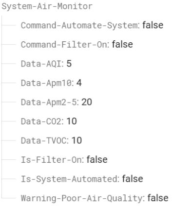
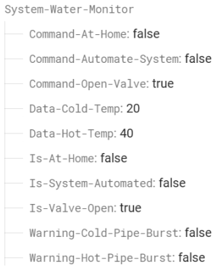
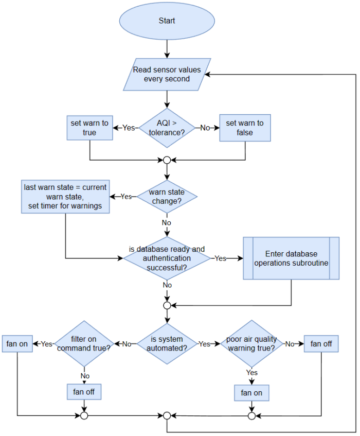

# IoT Burst Pipe Detection and Air Quality Monitoring System

## Overview
This repository hosts the Arduino codebase for an IoT-based home monitoring system designed to detect water leaks and ensure optimal indoor air quality. Controlled via a mobile application, the system provides real-time monitoring capabilities. The codebase is primarily written in C++, and it utilizes version 1.8.19 of the Arduino platform. While the mobile application frontend is not publicly released and is only available to the developer, the backend infrastructure and microcontroller connections were successfully set up.

## Table of Contents
- [IoT Burst Pipe Detection and Air Quality Monitoring System](#iot-burst-pipe-detection-and-air-quality-monitoring-system)
  - [Overview](#overview)
  - [Table of Contents](#table-of-contents)
  - [Libraries Used](#libraries-used)
  - [Key Features](#key-features)
  - [Requirements](#requirements)
    - [Data:](#data)
    - [Usability Requirements:](#usability-requirements)
    - [Backend Requirements:](#backend-requirements)
  - [Backend Database Implementation:](#backend-database-implementation)
    - [Firebase Integration](#firebase-integration)
    - [System Integration](#system-integration)

## Libraries Used
- **Firebase Arduino Library:** Utilized for integrating Firebase Realtime Database with the Arduino platform for data storage and retrieval.
- **ESP32 Board Library:** Facilitates communication between the ESP32 microcontroller and other components of the system.
- **Sensor Libraries:** Specific sensor libraries (e.g., for temperature and air quality sensors) are employed for data collection and processing.
- **Firebase Authentication Library:** Enables secure user authentication functionality through Firebase Authentication services.
- **Firebase Cloud Functions SDK:** Integrated for real-time data processing and automation triggers via Firebase Cloud Functions.

## Key Features
- **Real-time Monitoring:** Keep track of water supply and air quality in real-time.
- **User Authentication:** Secure login/signup functionality for users.
- **Automated Alerts:** Receive notifications for burst pipes and poor air quality.
- **Remote Control:** Control water supply and air filtration systems from anywhere.
- **Data Storage:** Store sensor readings, user commands, and automation settings securely.

## Requirements
### Data:
- **Sensor Readings:** Store real-time sensor data for water supply and air quality.
- **User Commands:** Store user instructions for system control.
- **Automation Settings:** Store user-defined automation rules based on sensor data.

### Usability Requirements:
- **Effectiveness:** Accurately display sensor readings and execute user commands.
- **Efficiency:** Ensure quick data display and system response times.
- **Safety:** Secure user data and prevent unauthorized access.
- **Utility:** Provide timely notifications and real-time data representation.

### Backend Requirements:
- **Data Storage:** Utilize Firebase Realtime Database for efficient data storage.
- **Authentication and Authorization:** Implement secure user authentication via Firebase Authentication.
- **Real-time Data Processing:** Utilize Firebase Cloud Functions for real-time data processing and system automation.

## Backend Database Implementation:
### Firebase Integration
- **Database Setup:** Utilize Firebase Realtime Database for storing sensor data and user information.
- **Authentication:** Implement Firebase Authentication for secure user login/signup.
- **Real-time Updates:** Leverage Firebase Realtime Database for seamless real-time data synchronization.
- **Data Security:** Ensure data security and user privacy with Firebase's built-in security features.

Below is the database schema used for the systems.

### System Integration
- **Microcontroller Connectivity:** Integrate ESP32 microcontrollers with Firebase for data transmission.
- **Sensor Connectivity:** Connect temperature and air quality sensors for data monitoring.
- **Data Processing:** Use Firebase Cloud Functions to process sensor data and trigger system actions.
- **Mobile Application Integration:** Connect the mobile app frontend to Firebase for real-time monitoring and control.

Both the air quality and burst pipe monitoring systems share a similar architecture, differing primarily in the types of sensor data they read and send, pre-warning timers implemented, and the devices they control, such as the filter fan or water supply line. Below is a flowchart for the Air quality monitoring system.

This backend database implementation using Firebase offers a robust solution for storing and processing sensor data, integrated with ESP32 microcontrollers, temperature sensors, and air quality sensors.
